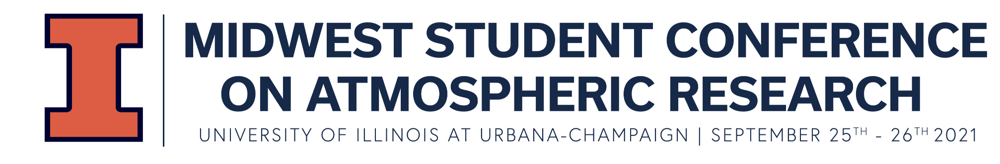

# The 2021 Midwest Student Conference on Atmospheric Research

**Welcome students!**

The Python ARM Radar Toolkit is a open source community platform for interacting with radar (and even LIDAR) data based
around a common data model. Py-ART is supported by the United States Department of Energy, Office of Science, 
[ARM program](https://www.arm.gov) and we are grateful for their support. 

Py-ART is a [community codebase with 38 contributors](https://github.com/ARM-DOE/pyart)!  

This *very* short course will give you an introduction to Py-ART. This will be mainly done in a
 demonstration mode with some time for exploring. This should be considered an on-ramp for your learning.
 
 Stay in touch by [joining the email list]( https://groups.google.com/group/pyart-users/)
 
 Follow [Scott](https://twitter.com/Cyclogenesis_au), [Bobby](https://twitter.com/rcjackson_wx),
 [Zach](https://twitter.com/zssherman) or [Py-ART](https://twitter.com/Py_ART) on Twitter. 
 
 The three notebooks are:
 1) [Reading data using Py-ART and a basic explore of the data model and plotting.](../1-Introduction/1_pyart_reading_and_plotting_data.ipynb)
 2) [Mapping polar radar data onto a cartesian grid and a bit more Cartopy fun](../1-Introduction/2_Introduction_to_gridding.ipynb)
 3) [An Application of Py-ART to NEXRAD in the Cloud and linking to MetPy](../2-Cloud_Examples/1-NEXRAD_on_Amazon.ipynb)
 
 Basic schedule (Central time):
 * 9am - 9:20 am Introduction and getting tech working
 * 9:20 am - 9:50 am Intro notebook
 * 9:50 am - 10 am  Break
 * 10 am - 10:20 am Mapping and griding
 * 10:20 am - 11 am Cloud example
 
 There are two ways to run the code for this course. Thanks to Pangeo, you can run it in the cloud. 
 If you are running the course this way please be patient when the instance is spinning up. The less risky but harder
  way is installing locally. **With 35 people signed up for the course and just Scott as an instructor 
  we will not be able to provide assistance in real time.**  If you run into an 
  issue follow along with the livestream. The Pangeo binder will stay live so you can try running 
  interactively at a later date. 
  
  ### Lets Go!
 
 To get started in the cloud click to launch this Pangeo (we LOVE Pangeo) hosted Binder: 
 
 
 If you want to install locally [Check out the readme](../README.md)

